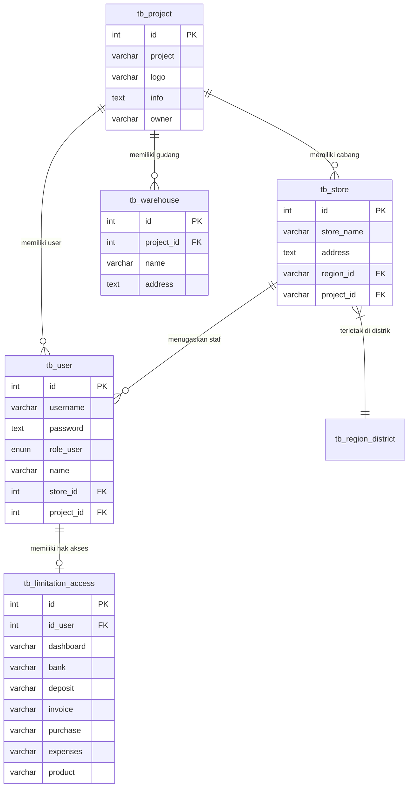
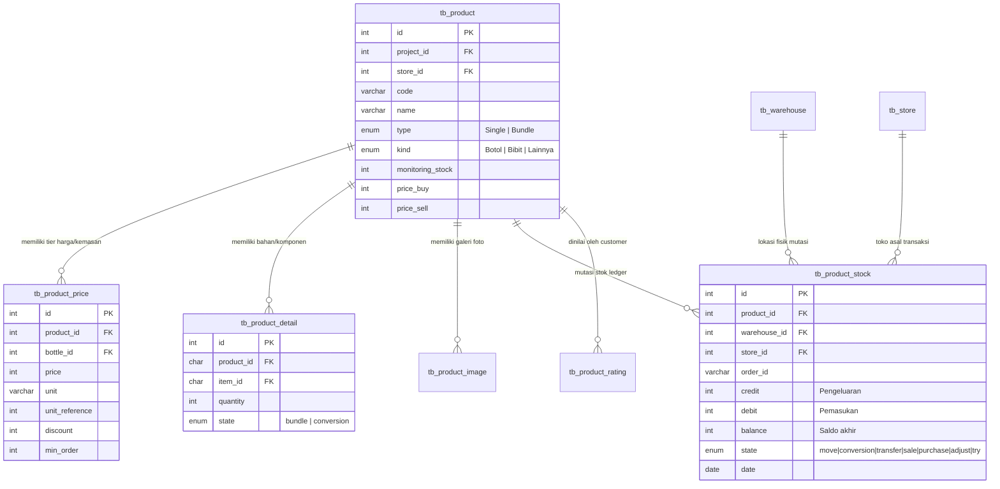
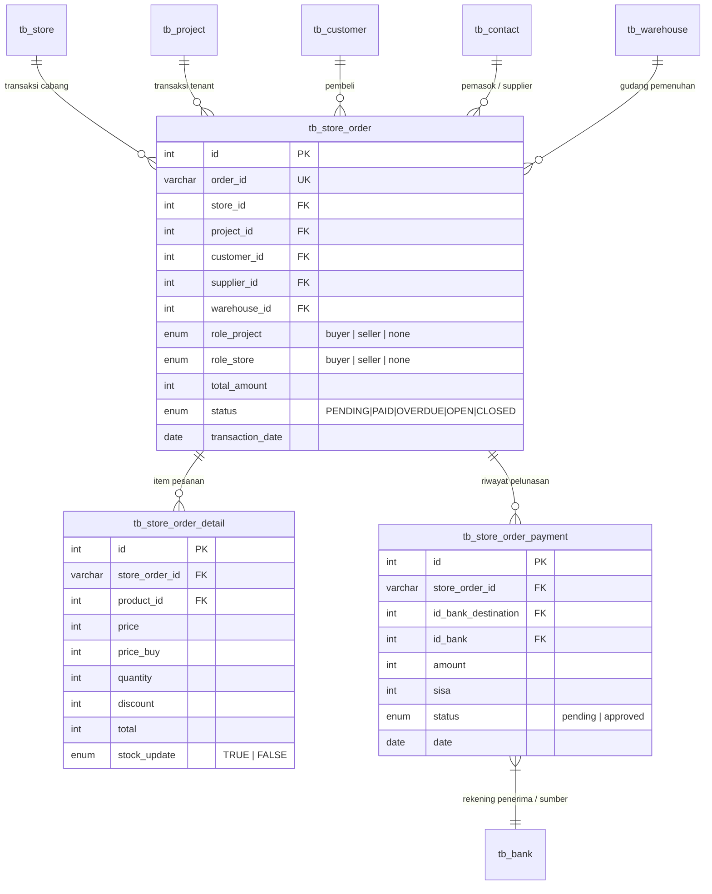
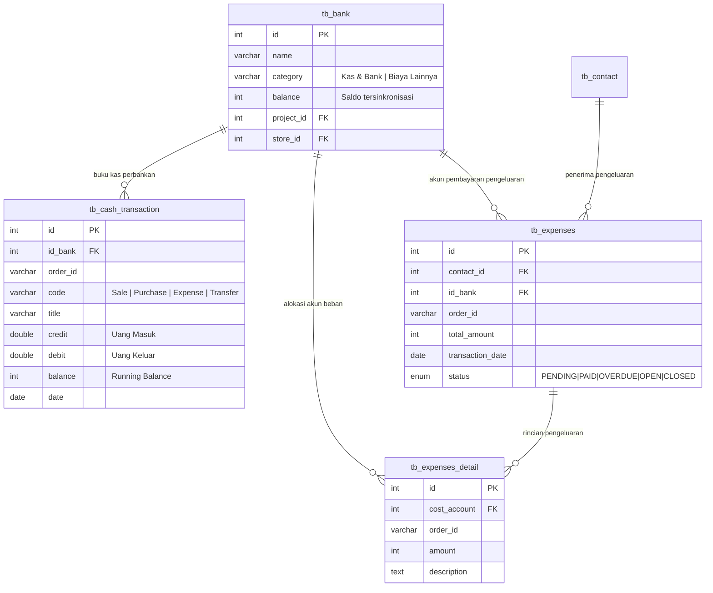
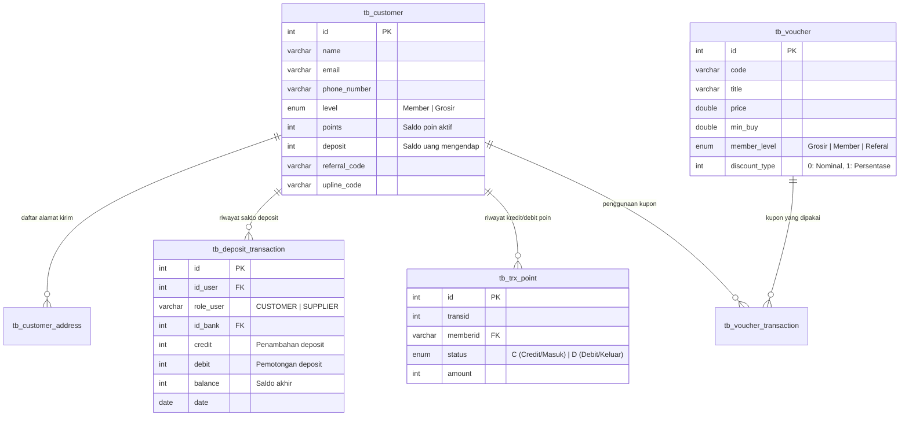

# Database Architecture Specification: FindFinancial / FindParfume

Dokumen ini mendokumentasikan arsitektur basis data, pemodelan entitas (*Entity-Relationship*), tata kelola transaksi keuangan dan stok (*ledger architecture*), prosedur rekonsiliasi, serta kamus data lengkap untuk platform **FindFinancial / FindParfume**.

---

## 1. Ikhtisar Arsitektur Basis Data (*System Overview*)

Platform FindFinancial dirancang sebagai sistem **ERP, POS (Point of Sale), Manajemen Stok Multi-Gudang, dan Akuntansi Kas Terpadu** yang melayani model bisnis ritel parfum, grosir, *multi-branch*, hingga pemesanan daring (*e-commerce / mobile app*).

### Spesifikasi Teknis Basis Data:
- **DBMS**: MySQL 8.0+ / MariaDB 10.4+
- **Storage Engine**: `InnoDB` (ACID-compliant untuk integritas finansial dan stok) & `MyISAM` (pada beberapa tabel data referensi legacy)
- **Karakter Set & Collation**: `utf8mb4` dengan collation `utf8mb4_unicode_ci` (mendukung multibyte string dan emoji)
- **Application Framework**: CodeIgniter 3 (Active Record / Query Builder & Native PDO Installer Engine)

### Prinsip Arsitektur Utama:
1. **Multi-Tenancy & Multi-Branch**: Hierarki kepemilikan bertingkat mulai dari **Project** (Tenant/Brand induk), **Store** (Cabang/Toko fisik), hingga **Warehouse** (Gudang penyimpanan fisik/logistik).
2. **Ledger / Double-Entry Ledger Pattern**: Seluruh mutasi finansial (kas & bank), persediaan barang (stok), deposit mitra, dan poin loyalitas dicatat sebagai buku besar (*running ledger*) dengan kolom debit, credit, dan running balance.
3. **Unified Order Architecture**: Entitas pesanan `tb_store_order` dapat berfungsi sebagai *Penjualan (Sales)*, *Pembelian (Purchase)*, maupun *Transfer Antar-Toko/Gudang* dengan memanfaatkan atribut diskriminator peran (`role_project` & `role_store`).
4. **Formula & Bundling Conversion (BOM)**: Produk dapat berupa barang jadi (*Single*) atau paket kombinasi (*Bundle* / konversi bahan baku) melalui relasi `tb_product_detail`. Penjualan produk rakitan secara otomatis memotong stok bahan baku (bibit parfum, botol kemasan).
5. **Shadow Archive Pattern (Soft-Delete & Audit)**: Setiap penghapusan transaksi kritikal (order, pembayaran, arus kas) tidak dihapus permanen (*hard purge*), melainkan disalin ke tabel shadow berakhiran `_delete` untuk keperluan audit forensik.

---

## 2. Diagram Hubungan Entitas (*Entity-Relationship Diagram*)

### 2.1. Arsitektur Multi-Tenancy, Cabang & Pengguna



---

### 2.2. Manajemen Katalog Produk, Formula/BOM & Buku Besar Stok



---

### 2.3. Transaksi Penjualan, Pembelian & Pembayaran (Store Order Subsystem)



---

### 2.4. Manajemen Arus Kas, Perbankan & Biaya Operasional (*Finance & Expenses*)



---

### 2.5. Pelanggan, Deposit Pre-paid, Poin Loyalitas & Voucher



---

## 3. Kamus Data Rinci (*Data Dictionary*)

### Modul 1: Entitas Organisasi & Multi-Tenant

#### 1. `tb_project`
Tabel entitas bisnis tertinggi (*tenant* / pemilik lisensi / brand induk).
| Nama Kolom | Tipe Data | Nullable | Default | Keterangan |
| :--- | :--- | :---: | :---: | :--- |
| `id` | `INT(11)` | NO | Auto Increment | Primary Key entitas proyek/tenant |
| `project` | `VARCHAR(100)` | NO | - | Nama bisnis/proyek (misal: "FindParfume Pusat") |
| `logo` | `VARCHAR(50)` | YES | NULL | Nama file/path logo bisnis |
| `info` | `TEXT` | NO | - | Keterangan atau profil singkat perusahaan |
| `owner` | `VARCHAR(50)` | NO | - | Nama pemilik atau penanggung jawab proyek |
| `created_date` | `TIMESTAMP` | NO | `CURRENT_TIMESTAMP` | Waktu pencatatan entitas |
| `updated_date` | `TIMESTAMP` | NO | `CURRENT_TIMESTAMP` | Waktu pembaharuan terakhir |
| `updated_by` | `VARCHAR(50)` | NO | `'system'` | Akun pengubah terakhir |

#### 2. `tb_store`
Tabel cabang/outlet fisik toko ritel.
| Nama Kolom | Tipe Data | Nullable | Default | Keterangan |
| :--- | :--- | :---: | :---: | :--- |
| `id` | `INT(11)` | NO | Auto Increment | Primary Key cabang toko |
| `store_name` | `VARCHAR(50)` | NO | - | Nama gerai/cabang toko |
| `address` | `TEXT` | NO | - | Alamat fisik toko |
| `region_id` | `VARCHAR(50)` | NO | - | Relasi ke ID wilayah (`tb_region_district.id`) |
| `project_id` | `VARCHAR(50)` | NO | - | Relasi ke entitas induk `tb_project.id` |
| `created_date` | `TIMESTAMP` | NO | `CURRENT_TIMESTAMP` | Waktu pembuatan toko |
| `updated_date` | `TIMESTAMP` | NO | `CURRENT_TIMESTAMP` | Waktu update toko |
| `updated_by` | `VARCHAR(50)` | NO | `'system'` | Akun pengubah terakhir |

#### 3. `tb_warehouse`
Tabel lokasi gudang penyimpanan fisik barang.
| Nama Kolom | Tipe Data | Nullable | Default | Keterangan |
| :--- | :--- | :---: | :---: | :--- |
| `id` | `INT(11)` | NO | Auto Increment | Primary Key gudang |
| `project_id` | `INT(11)` | NO | - | Relasi ke proyek induk `tb_project.id` |
| `name` | `VARCHAR(100)` | NO | - | Nama gudang (misal: "Gudang Utama", "Gudang Toko 1") |
| `address` | `TEXT` | YES | NULL | Alamat fisik gudang |
| `description` | `TEXT` | YES | NULL | Catatan kapasitas atau peruntukan gudang |
| `created_date` | `TIMESTAMP` | NO | `CURRENT_TIMESTAMP` | Waktu pencatatan |
| `updated_date` | `TIMESTAMP` | NO | `CURRENT_TIMESTAMP` | Waktu modifikasi |
| `updated_by` | `VARCHAR(50)` | NO | `'system'` | Operator pengubah |

#### 4. `tb_user` & `tb_limitation_access`
Pengelolaan otentikasi staf, peranan kerja, dan kontrol hak akses (*RBAC*).
| Tabel | Kolom Kunci | Keterangan |
| :--- | :--- | :--- |
| `tb_user` | `role_user` (`ENUM`) | Nilai: `'superadmin'`, `'admin'`, `'cashier'`, `'adminbranch'` |
| `tb_user` | `store_id`, `project_id` | Penugasan cabang dan entitas tenant user bekerja |
| `tb_limitation_access` | `id_user` | Relasi 1-to-1 ke `tb_user.id` |
| `tb_limitation_access` | Modul Akses (`VARCHAR(5)`) | Flag boolean string ('true'/'false') untuk modul: `dashboard`, `bank`, `deposit`, `cost_account`, `invoice`, `purchase`, `expenses`, `product`, `store`, `contact`, `tags`, `delete_invoice`, `edit_invoice`. |

---

### Modul 2: Katalog Produk, Resep/BOM & Persediaan Barang (*Inventory*)

#### 5. `tb_product`
Tabel master katalog produk barang jadi maupun bahan baku parfum.
| Nama Kolom | Tipe Data | Nullable | Default | Keterangan |
| :--- | :--- | :---: | :---: | :--- |
| `id` | `INT(11)` | NO | Auto Increment | Primary Key produk |
| `project_id` | `INT(11)` | NO | - | Relasi kepemilikan tenant |
| `store_id` | `INT(11)` | NO | - | Relasi cabang toko (0 jika global tenant) |
| `apps` | `ENUM('Y','N')` | NO | `'N'` | Flag ketersediaan produk di mobile app/katalog web |
| `apps_display` | `ENUM` | NO | `'none'` | Penempatan display: `'none'`, `'slide'`, `'new'`, `'top'` |
| `level` | `ENUM` | NO | - | Tingkat pelanggan yang ditargetkan: `'Grosir'`, `'Member'`, `'-'` |
| `code` | `VARCHAR(20)` | NO | `'0'` | Barcode / SKU unik produk |
| `name` | `VARCHAR(50)` | YES | NULL | Nama produk parfum / item |
| `type` | `ENUM` | YES | NULL | `'Single'` (produk mandiri), `'Bundle'` (paket rakitan) |
| `kind` | `ENUM` | NO | `'Lainnya'` | Klasifikasi item: `'Botol'`, `'Bibit'`, `'Lainnya'` |
| `monitoring_stock` | `INT(11)` | NO | `0` | Flag: 1 = pantau stok mandiri; 0 = potong stok resep/bahan baku |
| `unit` | `CHAR(3)` | YES | NULL | Satuan ukuran dasar (misal: 'ml', 'pcs', 'gr') |
| `weight` | `INT(11)` | NO | - | Bobot produk dalam gram (untuk kalkulasi ongkir) |
| `price_buy` | `INT(11)` | YES | `0` | Estimasi harga beli / HPP standar |
| `price_last_buy` | `INT(11)` | NO | `0` | Harga beli terakhir dari transaksi pembelian pemasok |
| `price_sell` | `INT(11)` | YES | `0` | Harga jual eceran standar |
| `price_sell_dollar`| `DOUBLE` | NO | `0` | Nilai patokan harga valuta asing (jika ada) |
| `category`, `subcategory`| `VARCHAR(50)` | YES | NULL | Taksonomi kategori produk |
| `permalink` | `VARCHAR(150)` | YES | NULL | URL slug ramah SEO untuk landing page web |

#### 6. `tb_product_detail` (Bill of Materials / Formula / Bundling)
Tabel formula yang mendefinisikan komposisi bahan suatu produk.
| Nama Kolom | Tipe Data | Nullable | Keterangan |
| :--- | :--- | :---: | :--- |
| `id` | `INT(11)` | NO | Auto Increment Primary Key |
| `product_id` | `CHAR(5)` | NO | ID produk jadi / bundle (`tb_product.id`) |
| `item_id` | `CHAR(5)` | NO | ID produk bahan penyusun (`tb_product.id`, e.g. Bibit / Botol) |
| `quantity` | `INT(11)` | YES | Rasio takaran / jumlah item yang dibutuhkan per unit produk jadi |
| `state` | `ENUM('bundle','conversion')` | NO | Jenis perakitan: paket promo (`bundle`) atau konversi racikan (`conversion`) |

#### 7. `tb_product_price`
Tabel skema multi-harga, konversi volume kemasan, dan diskon grosir bertingkat.
| Nama Kolom | Tipe Data | Nullable | Default | Keterangan |
| :--- | :--- | :---: | :---: | :--- |
| `id` | `INT(11)` | NO | Auto Increment | Primary Key tier harga |
| `product_id` | `INT(11)` | NO | - | Relasi ke produk utama |
| `bottle_id` | `INT(11)` | NO | `0` | ID botol kemasan terkait (`tb_product.id` tipe 'Botol') |
| `price` | `INT(11)` | NO | - | Nominal harga jual pada tier ini |
| `unit` | `VARCHAR(50)` | NO | - | Nama kemasan/satuan (misal: "30ml", "50ml", "100ml") |
| `unit_reference` | `INT(11)` | NO | - | Nilai konversi numerik terhadap satuan dasar (misal: 30 untuk 30ml) |
| `discount` | `INT(11)` | NO | - | Diskon reguler (persentase) |
| `discount_rupiah` | `INT(11)` | NO | - | Diskon tier 1 dalam nominal rupiah |
| `discount2_rupiah`| `INT(11)` | NO | - | Diskon tier 2 dalam nominal rupiah |
| `min_order` | `INT(11)` | NO | - | Batas minimal order untuk mendapatkan harga ini |
| `min_discount_order`| `INT(11)` | NO | - | Kuantitas minimum untuk memicu diskon tier 1 |
| `min_discount2_order`| `INT(11)` | NO | - | Kuantitas minimum untuk memicu diskon tier 2 |
| `weight` | `INT(11)` | NO | - | Bobot kotor kemasan (gram) |

#### 8. `tb_product_stock` (Inventory Ledger)
Buku besar mutasi keluar-masuk stok barang.
| Nama Kolom | Tipe Data | Nullable | Default | Keterangan |
| :--- | :--- | :---: | :---: | :--- |
| `id` | `INT(11)` | NO | Auto Increment | Primary Key log mutasi stok |
| `product_id` | `INT(11)` | NO | - | Produk yang bergerak |
| `warehouse_id` | `INT(11)` | NO | - | Gudang tempat persediaan berkurang/bertambah |
| `store_id` | `INT(11)` | NO | - | Toko pemrakarsa mutasi |
| `order_id` | `VARCHAR(50)` | YES | NULL | Nomor invoice / PO rujukan transaksi |
| `credit` | `INT(11)` | NO | - | Kuantitas barang keluar (*Stock Out*) |
| `debit` | `INT(11)` | NO | - | Kuantitas barang masuk (*Stock In*) |
| `balance` | `INT(11)` | NO | - | Saldo sisa stok fisik setelah mutasi |
| `calculated` | `CHAR(1)` | NO | `'Y'` | Status kalkulasi ledger |
| `date` | `DATE` | NO | - | Tanggal operasional mutasi |
| `state` | `ENUM` | NO | - | Jenis mutasi: `'move'`, `'conversion'`, `'transfer'`, `'sale'`, `'purchase'`, `'transfer-warehouse'`, `'adjust'`, `'try'` |

---

### Modul 3: Transaksi Penjualan, Pembelian & POS (*Store Orders*)

#### 9. `tb_store_order`
Tabel header transaksi induk untuk penjualan (POS/Invoicing) dan pembelian (Purchase Order).
| Nama Kolom | Tipe Data | Nullable | Default | Keterangan |
| :--- | :--- | :---: | :---: | :--- |
| `id` | `INT(11)` | NO | Auto Increment | Primary Key |
| `store_id` | `INT(11)` | NO | `0` | ID toko pelaksana |
| `project_id` | `INT(11)` | NO | `0` | ID tenant pemilik transaksi |
| `customer_id` | `INT(11)` | NO | `0` | ID pelanggan (jika transaksi penjualan/POS) |
| `supplier_id` | `INT(11)` | NO | - | ID pemasok `tb_contact.id` (jika pembelian) |
| `warehouse_id` | `INT(11)` | NO | - | Gudang asal barang (penjualan) atau tujuan (pembelian) |
| `order_id` | `VARCHAR(50)` | YES | NULL | Nomor dokumen faktur/PO (e.g. "INV/2026/09/0001") |
| `customer_name` | `VARCHAR(50)` | YES | NULL | Nama pembeli non-terdaftar (walk-in POS) |
| `role_project` | `ENUM` | NO | `'none'` | Peran entitas tenant: `'buyer'`, `'seller'`, `'none'` |
| `role_store` | `ENUM` | NO | `'none'` | Peran entitas toko cabang: `'buyer'`, `'seller'`, `'none'` |
| `nopo` | `VARCHAR(8)` | YES | NULL | Nomor Purchase Order manual (jika dari B2B) |
| `amount` | `INT(11)` | YES | NULL | Subtotal kotor sebelum diskon |
| `discount` | `INT(11)` | YES | NULL | Total potongan harga |
| `total_amount` | `INT(11)` | YES | NULL | Total tagihan bersih (`amount - discount + shipping_cost`) |
| `billing_due_date` | `DATE` | NO | - | Tanggal jatuh tempo pembayaran tempo |
| `shipping_cost`| `INT(11)` | NO | `0` | Biaya pengiriman barang |
| `transaction_date` | `DATE` | NO | - | Tanggal transaksi dibuat |
| `invoice_date` | `DATE` | NO | - | Tanggal faktur diterbitkan |
| `poin` | `INT(11)` | NO | `0` | Poin reward yang dihasilkan/digunakan |
| `status` | `ENUM` | NO | `'OPEN'` | Status faktur: `'PENDING'`, `'PAID'`, `'OVERDUE'`, `'OPEN'`, `'CLOSED'` |

#### 10. `tb_store_order_detail`
Rincian item produk dalam sebuah transaksi `tb_store_order`.
| Nama Kolom | Tipe Data | Nullable | Default | Keterangan |
| :--- | :--- | :---: | :---: | :--- |
| `id` | `INT(11)` | NO | Auto Increment | Primary Key detail |
| `store_order_id`| `VARCHAR(50)` | NO | - | Menghubungkan ke `tb_store_order.order_id` |
| `product_id` | `INT(11)` | NO | - | ID produk yang diperjualbelikan |
| `price` | `INT(11)` | NO | - | Harga jual per unit saat transaksi berlangsung |
| `price_buy` | `INT(11)` | NO | - | Harga pokok modal (COGS) per unit |
| `quantity` | `INT(11)` | NO | `0` | Kuantitas unit |
| `discount` | `INT(11)` | NO | `0` | Nilai potongan harga item |
| `total` | `INT(11)` | NO | `0` | Total nominal bersih baris item |
| `stock_update` | `ENUM('FALSE','TRUE')` | NO | `'FALSE'` | Flag sinkronisasi apakah mutasi stok sudah diproses ke `tb_product_stock` |

#### 11. `tb_store_order_payment`
Pencatatan termin pembayaran (cash, transfer, kartu, deposit) terhadap pesanan toko.
| Nama Kolom | Tipe Data | Nullable | Keterangan |
| :--- | :--- | :---: | :--- |
| `id` | `INT(11)` | NO | Auto Increment Primary Key |
| `store_order_id` | `VARCHAR(50)` | NO | Relasi ke `tb_store_order.order_id` |
| `id_bank` | `INT(11)` | NO | Akun kas/bank asal (pembayar) |
| `id_bank_destination` | `INT(11)` | NO | Akun kas/bank tujuan penerimaan (`tb_bank.id`) |
| `order_id` | `VARCHAR(50)` | YES | Kode referensi pembayaran |
| `amount` | `INT(11)` | NO | Nominal pembayaran yang disetorkan |
| `sisa` | `INT(11)` | NO | Sisa piutang/hutang pesanan setelah pembayaran ini |
| `notes` | `VARCHAR(30)` | NO | Termin pembayaran (misal: "Pembayaran ke-1", "Lunas") |
| `status` | `ENUM('pending','approved')`| NO | Status verifikasi dana diterima |
| `date` | `DATE` | NO | Tanggal setoran dana |

---

### Modul 4: Akuntansi Kas, Rekening Perbankan & Biaya (*Cash & Expenses*)

#### 12. `tb_bank`
Master akun kasir, brankas toko, dan rekening bank.
| Nama Kolom | Tipe Data | Nullable | Default | Keterangan |
| :--- | :--- | :---: | :---: | :--- |
| `id` | `INT(11)` | NO | Auto Increment | Primary Key akun kas/bank |
| `name` | `VARCHAR(50)` | NO | - | Nama akun (misal: "Kas Toko Pusat", "BCA Operasional") |
| `category` | `VARCHAR(50)` | NO | `'Kas & Bank'` | Kategori COA ('Kas & Bank' atau Akun Biaya) |
| `sub` | `VARCHAR(20)` | YES | `'main'` | Klasifikasi sub-rekening |
| `balance` | `INT(11)` | NO | - | Saldo terkini akun kas (dikalibrasi oleh prosedur) |
| `project_id` | `INT(11)` | NO | - | Pemilik tenant |
| `store_id` | `INT(11)` | NO | - | Lokasi cabang kasir |

#### 13. `tb_cash_transaction`
Buku kas umum (*General Cash Ledger*) yang mencatat setiap aliran dana masuk dan keluar.
| Nama Kolom | Tipe Data | Nullable | Default | Keterangan |
| :--- | :--- | :---: | :---: | :--- |
| `id` | `INT(11)` | NO | Auto Increment | Primary Key entri kas |
| `id_bank` | `INT(11)` | NO | - | Akun kas yang terpengaruh (`tb_bank.id`) |
| `order_id` | `VARCHAR(50)` | NO | - | Dokumen sumber (No Invoice, Expense ID, dll.) |
| `code` | `VARCHAR(50)` | YES | NULL | Tagging transaksi (e.g. `'Sale'`, `'Purchase'`, `'Expense'`) |
| `title` | `VARCHAR(100)` | NO | - | Keterangan ringkas transaksi penerimaan/pengeluaran |
| `credit` | `DOUBLE` | NO | - | Dana masuk (*Cash Inflow*) |
| `debit` | `DOUBLE` | NO | - | Dana keluar (*Cash Outflow*) |
| `balance` | `INT(11)` | NO | - | Saldo kas berjalan (*Running Balance*) |
| `memo` | `VARCHAR(50)` | YES | NULL | Catatan internal transaksi |
| `date` | `DATE` | NO | - | Tanggal pembukuan |

#### 14. `tb_expenses` & `tb_expenses_detail`
Header dan rincian pengeluaran operasional non-persediaan (misal: listrik, sewa, gaji, perlengkapan).
- `tb_expenses`: Mencatat tanggal, total pengeluaran, akun kas pembayar (`id_bank`), pihak penerima (`contact_id`), dan status pelunasan.
- `tb_expenses_detail`: Mencatat itemisasi alokasi pos biaya (`cost_account` merujuk pada `tb_bank.id` kategori beban) beserta nominalnya.

---

### Modul 5: Pelanggan, Deposit Pre-paid, Loyalty & E-Commerce

#### 15. `tb_customer` & `tb_customer_address`
- `tb_customer`: Menyimpan profil pelanggan ritel/reseller, keanggotaan (`Member` / `Grosir`), akumulasi saldo loyalitas `points`, saldo titipan belanja `deposit`, dan skema afiliasi (`referral_code` & `upline_code`).
- `tb_customer_address`: Buku alamat kirim pelanggan mencakup koordinat geolokasi (lat/long) dan rujukan wilayah (`region_province`, `region_regency`, `region_subdistrict`, `postal_code`).

#### 16. `tb_deposit_transaction`
Buku besar deposit (*Prepaid Balance*) pelanggan dan uang muka ke supplier.
- Menggunakan skema `credit` (penambahan saldo simpanan) dan `debit` (pemakaian saldo untuk bayar faktur).
- Nilai saldo terkini `tb_customer.deposit` dan `tb_contact.deposit` dikendalikan melalui prosedur tersimpan.

#### 17. `tb_trx_point` & `tb_product_poin`
- `tb_trx_point`: Ledger perolehan (`status = 'C'`) dan penukaran (`status = 'D'`) poin reward pelanggan.
- `tb_product_poin`: Aturan dinamis perolehan poin per SKU produk berdasarkan level keanggotaan dan periode promo.

#### 18. `tb_customer_order` & `tb_customer_order_detail`
Kanal transaksi terpisah untuk pesanan daring dari aplikasi seluler / website Florean.
- Mendukung integrasi payment gateway Midtrans via kolom `trans_id`, `invoice_url`, `payment_status`.
- Siklus hidup pesanan: `'Pending'` $\rightarrow$ `'Payment'` $\rightarrow$ `'Shipping'` $\rightarrow$ `'Done'` (atau `'Cancel'`).

---

### Modul 6: Shadow Archive Tables (Audit & Data Recovery)

Untuk menjamin ketaatan audit finansial (*financial audit compliance*), sistem menyediakan tabel duplikat dengan skema identik untuk menampung rekaman yang dihapus pengguna:
- **`tb_store_order_delete`**: Menampung faktur penjualan/pembelian yang dihapus dari `tb_store_order`.
- **`tb_store_order_detail_delete`**: Menampung baris item yang terhapus dari `tb_store_order_detail`.
- **`tb_store_order_payment_delete`**: Menampung data pembayaran yang dibatalkan dari `tb_store_order_payment`.
- **`tb_cash_transaction_delete`**: Menampung mutasi kas yang dibatalkan dari `tb_cash_transaction`.

---

## 4. Arsitektur Database Views

Basis data menyediakan 13+ *Database Views* teroptimasi untuk menyederhanakan kueri agregasi laporan, POS, dan display frontend:

```
+-------------------------------+------------------------------------------------------------------------------------+
| Nama View                     | Deskripsi & Logika Join                                                            |
+-------------------------------+------------------------------------------------------------------------------------+
| view_user                     | tb_user + tb_store + tb_project (Data lengkap otentikasi user, nama toko & cabang)|
| view_store                    | tb_store + tb_region_district + tb_region_province (Hierarki alamat cabang)        |
| view_product                  | tb_product + tb_product_price + tb_product_stock + tb_product_image (Katalog POS) |
| view_price_apps               | tb_product_price + tb_product + pairing tb_product botol kemasan                  |
| view_product_stock_warehouse  | tb_product + tb_product_stock (Kalkulasi realtime SUM(credit) - SUM(debit))       |
| view_store_order              | tb_store_order + tb_warehouse + agregasi SUM(tb_store_order_payment.amount) AS paid|
| view_store_order_detail       | tb_store_order_detail + tb_product (Rincian nota kasir & PO)                       |
| view_store_order_payment      | tb_store_order_payment + bank_from (tb_bank) + bank_destination (tb_bank)          |
| view_expenses                 | tb_expenses + tb_contact + tb_bank (Rekap pengeluaran operasional)                |
| view_expenses_detail          | tb_expenses_detail + tb_bank pos akun beban                                       |
| view_deposit_transaction      | tb_deposit_transaction UNION ALL dengan tb_customer dan tb_contact                 |
| view_customer_order           | tb_customer_order + tb_customer + tb_customer_address                              |
| view_customer_order_detail    | tb_customer_order_detail + view_product + tb_product_price                         |
+-------------------------------+------------------------------------------------------------------------------------+
```

### Logika Kunci pada View Utama:

#### 1. `view_store_order`
Mengagregasi pembayaran yang berstatus `'approved'` secara otomatis untuk menghasilkan kolom virtual `paid`:
```sql
IFNULL(
    SUM(CASE WHEN `tb_store_order_payment`.`status` = 'approved' 
        THEN `tb_store_order_payment`.`amount` ELSE 0 END), 
    0
) AS `paid`
```
Hal ini memungkinkan pengecekan piutang / *outstanding balance* langsung melalui rumus:
$$\text{Sisa Piutang} = \text{total\_amount} - \text{paid}$$

#### 2. `view_product_stock_warehouse`
Menghitung saldo fisik persediaan per gudang tanpa perlu mengandalkan kolom statis yang rentan desinkronisasi:
```sql
SUM(`tb_product_stock`.`credit`) - SUM(`tb_product_stock`.`debit`) AS `stock`
```

---

## 5. Prosedur Tersimpan & Rekonsiliasi Saldo (*Stored Procedures*)

Untuk mengatasi potensi inkonsistensi data (*data drift*) akibat konkurensi transaksi kasir atau kegagalan jaringan, sistem mengimplementasikan 4 Prosedur Tersimpan (*Stored Procedures*) MySQL:

### 1. `FixBankBalance(IN id_bank INT)`
Menghitung ulang total mutasi kas dari `tb_cash_transaction` dan memperbarui saldo agregat `tb_bank.balance`.
- **Formula**:
  $$\text{balance} = \sum(\text{credit}) - \sum(\text{debit})$$
- **Implementasi SQL**:
  ```sql
  CREATE PROCEDURE `FixBankBalance`(IN `id_bank` INT(11))
  BEGIN
      DECLARE credit float;
      DECLARE debit float;
      DECLARE balance float;

      SET credit = IFNULL((SELECT SUM(credit) FROM tb_cash_transaction WHERE id_bank = id_bank), 0);
      SET debit  = IFNULL((SELECT SUM(debit)  FROM tb_cash_transaction WHERE id_bank = id_bank), 0);
      SET balance = credit - debit;

      UPDATE tb_bank SET tb_bank.balance = balance WHERE tb_bank.id = id_bank;
  END;
  ```

### 2. `FixPointsCustomer(IN id_customer INT)`
Mengkalkulasi ulang saldo poin aktif pelanggan dari ledger `tb_trx_point`:
- **Formula**:
  $$\text{points} = \sum(\text{amount}_{\text{status='C'}}) - \sum(\text{amount}_{\text{status='D'}})$$
- Memperbarui langsung kolom `tb_customer.points`.

### 3. `FixDepositCustomer(IN id_user INT)` & `FixDepositSupplier(IN id_user INT)`
Mengkalkulasi ulang saldo simpanan deposit pelanggan atau pemasok dari tabel `tb_deposit_transaction`:
- Memfilter berdasarkan `role_user = 'customer'` atau `role_user = 'supplier'`.
- Memperbarui kolom `tb_customer.deposit` dan `tb_contact.deposit`.

---

## 6. Pola & Alur Bisnis Kunci (*Key Architectural Workflows*)

### 6.1. Alur Transaksi Kasir POS & Pemotongan Stok

```
[Kasir Membuat Transaksi POS]
               │
               ▼
   1. Insert tb_store_order (status: 'PAID' / 'OPEN', role_store: 'seller')
               │
               ▼
   2. Insert tb_store_order_detail (produk, qty, harga jual, HPP price_buy)
               │
               ├───────────────────────────────────────────────┐
               ▼ (Monitoring Stock = 1)                        ▼ (Monitoring Stock = 0 / Racikan)
   Insert tb_product_stock                             Baca tb_product_detail (BOM)
   (credit: qty, state: 'sale')                                │
                                                               ▼
                                                       Insert tb_product_stock
                                                       untuk masing-masing bahan baku
                                                       (Bibit Parfum ml, Botol pcs)
               │
               ▼
   3. Insert tb_store_order_payment (status: 'approved', id_bank_destination)
               │
               ▼
   4. Insert tb_cash_transaction (code: 'Sale', credit: amount, id_bank)
               │
               ▼
   5. Eksekusi Stored Procedure: CALL FixBankBalance(id_bank_destination)
```

### 6.2. Alur Pembelian dari Supplier (*Purchase Order*)

```
[Admin Membuat Purchase Order]
               │
               ▼
   1. Insert tb_store_order (role_store: 'buyer', supplier_id: X, warehouse_id: Y)
               │
               ▼
   2. Insert tb_store_order_detail (qty, price_buy)
               │
               ▼
   3. Update tb_product.price_last_buy = price_buy (Pembaruan HPP Modal Berjalan)
               │
               ▼
   4. Insert tb_product_stock (debit: qty, warehouse_id: Y, state: 'purchase')
               │
               ▼
   5. Pelunasan: Insert tb_store_order_payment & Insert tb_cash_transaction (debit: amount)
```

---

## 7. Strategi Pengindeksan & Rekomendasi Kinerja (*Indexing & Optimization*)

### Indeks yang Sudah Diterapkan:
1. **Primary Key Clustering**: Seluruh tabel menggunakan `id INT AUTO_INCREMENT` yang dikelompokkan secara fisik (*clustered index*).
2. **Foreign Key Indexing**: Kolom foreign key umum telah diindeks:
   - `tb_product_stock` $\rightarrow$ `product_id`, `warehouse_id`, `store_id`, `order_id`
   - `tb_store_order` $\rightarrow$ `store_id`, `project_id`, `customer_id`, `supplier_id`, `warehouse_id`, `order_id`
   - `tb_cash_transaction` $\rightarrow$ `id_bank`, `order_id`
   - `tb_postalcode` $\rightarrow$ `postal_code` (mendukung pencarian ongkir cepat)

### Rekomendasi Optimasi Lanjutan (*Database Hardening*):
1. **Composite Index pada Ledger Stok**:
   Pencarian mutasi stok sering memfilter berdasarkan produk, gudang, dan tanggal:
   ```sql
   ALTER TABLE `tb_product_stock` ADD INDEX `idx_product_warehouse_date` (`product_id`, `warehouse_id`, `date`);
   ```
2. **Composite Index pada Transaksi Kas**:
   Laporan laba-rugi dan arus kas memfilter bank dan rentang tanggal:
   ```sql
   ALTER TABLE `tb_cash_transaction` ADD INDEX `idx_bank_date` (`id_bank`, `date`);
   ```
3. **Konversi Sisa Tabel MyISAM ke InnoDB**:
   Beberapa tabel referensi (`tb_limitation_access`, `tb_region_district`, `tb_voucher`) masih menggunakan engine `MyISAM`. Disarankan untuk mengonversi semuanya ke `InnoDB` demi konsistensi *row-level locking* dan *crash recovery*.

---

## 8. Ringkasan File & Direktori Sumber Skema

| Lokasi Berkas | Peran / Deskripsi |
| :--- | :--- |
| `database/CREATE_MASTER_DATA.SQL` | DDL pendefinisian seluruh 39 tabel master dan transaksi sistem |
| `database/CREATE_INDEX.SQL` | Definisi Primary Key, Auto Increment, dan Secondary Index |
| `database/CREATE_VIEW.SQL` | Definisi 13 Database Views untuk reporting dan join relasional |
| `database/CREATE_PROCEDURE.SQL` | Implementasi 4 Stored Procedures untuk rekonsiliasi saldo otomatis |
| `database/INSERT_MASTER_DATA.SQL` | Data awal (*seed data*) wilayah, akun sistem, dan parameter default |
| `database/ALTER_TABLE_INSTANT.SQL` | Patch skema inkremental |
| `application/config/database.php` | Konfigurasi koneksi MySQL CodeIgniter (menggunakan variabel environment `.env`) |
| `application/config/databases.php` | Peta berkas instalasi otomatis skema basis data |
| `application/controllers/install/database/Database.php` | Controller migrasi dan eksekusi skrip SQL via PDO REST API |
