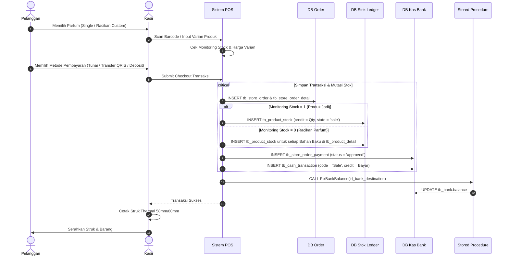
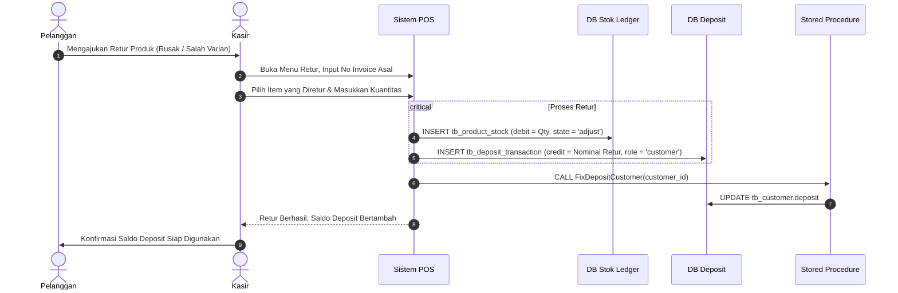

# Functional Specification Document (FSD): FindFinancial / FindParfume

| Metadata Dokumen | Deskripsi |
| :--- | :--- |
| **Nama Sistem** | FindFinancial / FindParfume Enterprise ERP & POS System |
| **Versi Dokumen** | 1.0.0 |
| **Tanggal Terbit** | September 2026 |
| **Kategori Sistem** | Point of Sale (POS), Inventory Management, Multi-Warehouse ERP, & Financial Accounting |
| **Teknologi Utama** | PHP 7/8 (CodeIgniter 3 MVC), MySQL 8.0+ / MariaDB 10.4+ (InnoDB Engine), Midtrans PG, Firebase, OneSignal |
| **Status Dokumen** | Approved / Production Specification |

---

## 1. Pendahuluan (*Introduction*)

### 1.1 Latar Belakang & Tujuan
**FindFinancial (FindParfume)** merupakan sistem informasi terpadu berskala *enterprise* yang dirancang khusus untuk memenuhi kebutuhan industri ritel, grosir, dan manufaktur parfum/wewangian. Sistem ini menggabungkan fungsi operasional kasir cabang (*Point of Sale*), manajemen resep/racikan formula parfum (*Bill of Materials*), persediaan multi-gudang, pengadaan barang, akuntansi kas/bank berbasis *double-entry ledger*, hingga pengelolaan pesanan daring melalui portal website dan aplikasi seluler (Florean Marketplace & Kiosk).

Dokumen **Functional Specification Document (FSD)** ini bertujuan untuk menjabarkan seluruh fungsionalitas sistem secara mendalam, memetakan setiap proses bisnis terhadap arsitektur basis data, menetapkan aturan validasi (*business rules*), serta menjadi acuan pengembangan, pengujian (*QA*), dan pemeliharaan sistem.

### 1.2 Cakupan Sistem (*System Scope*)
Sistem FindFinancial mencakup modul-modul fungsional berikut:
1. **Multi-Tenancy & Organisasi**: Proyek tenant induk, cabang toko, dan lokasi gudang penyimpanan.
2. **Otentikasi & Keamanan Hak Akses (RBAC)**: Kontrol akses berbasis peranan pengguna dan perizinan berbutir halus per modul.
3. **Katalog Produk, Resep/BOM & Skema Harga**: Manajemen produk tunggal/paket, takaran racikan (*Bill of Materials*), varian kemasan/botol, dan harga grosir/member.
4. **Manajemen Persediaan (*Inventory Ledger*)**: Pelacakan mutasi barang masuk/keluar, transfer antar-gudang, konversi stok bahan baku, dan penyesuaian (*stock opname*).
5. **Kasir POS & Penjualan (*Point of Sale & Invoicing*)**: Antarmuka kasir cepat, cetak struk thermal, pencatatan termin pelunasan, dan penerbitan faktur/surat jalan PDF.
6. **Retur Penjualan (*Sales Return*)**: Pengembalian kuantitas produk dengan konversi otomatis ke deposit saldo pelanggan.
7. **Pengadaan & Pembelian (*Procurement & Purchase Order*)**: Pemesanan ke pemasok (*supplier*), pembaruan modal HPP berjalan (*Moving Average / Last Buy Price*), dan pencatatan utang usaha.
8. **Manajemen Kas, Bank & Biaya Operasional**: Buku kas umum (*General Cash Ledger*), transfer antar-rekening kas, dan rincian alokasi biaya operasional (*expenses*).
9. **Pelanggan, Deposit & Program Loyalitas**: Saldo uang muka (*prepaid deposit*), tier member, akumulasi poin reward dinamis, dan kode voucher promo.
10. **E-Commerce & Kiosk Channel (Florean)**: Integrasi transaksi online, alokasi gudang pemenuhan, dan gateway pembayaran Midtrans.
11. **Pelaporan Finansial & Analisis Laba Rugi**: Laporan laba kotor, laporan laba rugi (*Income Statement*), rincian pendapatan (*revenue*), dan analisis HPP (*Cost of Goods Sold*).
12. **Content Management & Notifikasi**: Banner promosi, blog edukasi parfum, menu kiosk, serta push notification Firebase/OneSignal.

### 1.3 Definisi, Istilah & Singkatan
- **BOM (*Bill of Materials*)**: Formula atau daftar bahan baku (bibit parfum, botol, alkohol) yang menyusun 1 unit produk jadi.
- **COGS / HPP (*Cost of Goods Sold / Harga Pokok Penjualan*)**: Biaya modal riil pengadaan barang dagang.
- **Monitoring Stock**: Indikator apakah stok produk dipantau mandiri (1) atau dipotongkan dari bahan baku komponen penyusunnya (0).
- **Ledger Pattern**: Pola pembukuan transaksi di mana saldo akhir tidak di-overwrite langsung, melainkan dikalkulasi dari baris mutasi debit/credit.
- **Shadow Archive Table**: Tabel duplikat berakhiran `_delete` yang menampung data riwayat penghapusan demi keperluan audit finansial.
- **POS (*Point of Sale*)**: Antarmuka kasir di toko fisik untuk melayani transaksi pembayaran langsung pelanggan.

---

## 2. Aktor Sistem & Matriks Hak Akses (*Role & Access Control*)

Sistem mengimplementasikan otorisasi bertingkat melalui tabel `tb_user` dan tabel kontrol akses granular `tb_limitation_access`.

### 2.1 Peran Pengguna (*User Personas*)
1. **Superadmin**: Pemilik sistem atau manajemen eksekutif tertinggi yang memiliki akses tidak terbatas ke seluruh proyek, cabang toko, pengaturan keuangan, audit log, dan modul sistem.
2. **Admin (Pusat / Project)**: Pengelola operasional level brand/tenant induk yang bertanggung jawab atas katalog produk, penetapan harga, stok gudang pusat, pengadaan pembelian ke supplier, dan laporan laba rugi.
3. **Admin Branch (Kepala Cabang)**: Pengelola gerai/toko cabang yang mengawasi stok toko cabang, kasir lokal, dan mutasi barang cabang.
4. **Cashier (Kasir Toko)**: Staf garis depan yang mengoperasikan mesin kasir POS, menerima pembayaran kas/non-kas, mencetak struk thermal, dan melakukan retur barang langsung.

### 2.2 Matriks Hak Akses Modul

| Modul Fungsional | Superadmin | Admin Pusat | Admin Branch | Cashier |
| :--- | :---: | :---: | :---: | :---: |
| **Dashboard & Ringkasan Penjualan** | Full Access | Full Access | Cabang Sendiri | Kasir Sendiri |
| **Manajemen Proyek & Cabang Toko** | Full CRUD | View Only | No Access | No Access |
| **Manajemen Kas & Rekening Bank** | Full CRUD | Full CRUD | View Cabang | Setor Kasir |
| **Katalog Produk & Formula/BOM** | Full CRUD | Full CRUD | View Only | View POS |
| **Penetapan Harga & Diskon Grosir** | Full CRUD | Full CRUD | No Access | No Access |
| **Gudang & Transfer Antar-Gudang** | Full CRUD | Full CRUD | Gudang Cabang | No Access |
| **Stock Opname & Penyesuaian Stok** | Full CRUD | Full CRUD | Cabang Sendiri | No Access |
| **Kasir POS & Pembuatan Invoice** | Full CRUD | Full CRUD | Full CRUD | Full (Kasir) |
| **Approval Pembayaran Piutang** | Full CRUD | Full CRUD | Cabang Sendiri | No Access |
| **Hapus Transaksi Invoice** | Allowed | By Permission | No Access | No Access |
| **Pembelian Supplier (PO)** | Full CRUD | Full CRUD | By Permission | No Access |
| **Pengeluaran Biaya (Expenses)** | Full CRUD | Full CRUD | Cabang Sendiri | No Access |
| **Kelola Deposit Pelanggan & Supplier** | Full CRUD | Full CRUD | View Only | Gunakan Saldo |
| **Kelola Poin & Voucher Promo** | Full CRUD | Full CRUD | No Access | Redeem Voucher |
| **Laporan Finansial (Laba Rugi & HPP)**| Full Access | Full Access | Ringkasan Cabang | No Access |

---

## 3. Spesifikasi Kebutuhan Fungsional (*Functional Requirements*)

---

### Modul 3.1: Otentikasi & Manajemen Pengguna (FR-AUTH)

#### FR-AUTH-01: Otentikasi Masuk (*Login Staf*)
- **Deskripsi**: Memvalidasi kredensial staf yang masuk ke portal dashboard atau kasir.
- **Input**: `username`, `password`.
- **Aturan Bisnis**:
  1. Sandi diverifikasi menggunakan pencocokan hash aman.
  2. Sistem menyimpan token sesi `findparfume_user` berisi: `id`, `username`, `role_user`, `store_id`, `project_id`.
  3. Mengambil record hak akses dari `tb_limitation_access` untuk mengontrol visibilitas navigasi menu.
- **Tabel Terkait**: `tb_user`, `tb_limitation_access`.

#### FR-AUTH-02: Konfigurasi Akses Granular (*Access Permission Setup*)
- **Deskripsi**: Mengatur sakelar izin akses modul individual per pengguna.
- **Aturan Bisnis**: Hak akses disimpan dalam bentuk status flag string (`'true'` / `'false'`) pada setiap modul: `dashboard`, `bank`, `deposit`, `invoice`, `purchase`, `expenses`, `product`, `store`, `contact`, `delete_invoice`, `edit_invoice`.
- **Tabel Terkait**: `tb_limitation_access`.

---

### Modul 3.2: Master Data Organisasi & Logistik (FR-ORG)

#### FR-ORG-01: Manajemen Multi-Tenant (*Project*)
- **Deskripsi**: Mendefinisikan unit bisnis/brand induk pemilik data operasional.
- **Aturan Bisnis**: Setiap transaksi, produk, akun kas, dan pengguna wajib terasosiasi dengan `project_id`.
- **Tabel Terkait**: `tb_project`.

#### FR-ORG-02: Manajemen Cabang Toko (*Store*)
- **Deskripsi**: Mengelola gerai/toko fisik cabang tempat transaksi POS dilangsungkan.
- **Aturan Bisnis**:
  1. Pembuatan toko baru otomatis mengasosiasikan toko dengan ID wilayah distrik (`region_id`).
  2. Sesuai arsitektur bisnis, pembuatan toko baru memicu pembentukan gudang default untuk cabang tersebut.
- **Tabel Terkait**: `tb_store`, `tb_region_district`, `tb_region_province`.

#### FR-ORG-03: Manajemen Gudang (*Warehouse*)
- **Deskripsi**: Mengelola titik penyimpanan persediaan fisik produk.
- **Aturan Bisnis**: Gudang bertindak sebagai entitas penampung fisik persediaan barang pada ledger `tb_product_stock`.
- **Tabel Terkait**: `tb_warehouse`.

---

### Modul 3.3: Katalog Produk, Resep/BOM & Penetapan Harga (FR-PROD)

#### FR-PROD-01: Pendaftaran Master Produk
- **Deskripsi**: Menambahkan produk parfum baru ke dalam sistem.
- **Input**: Nama, SKU/Barcode unik, kategori, subkategori, jenis (`Single` / `Bundle`), klasifikasi (`Botol`, `Bibit`, `Lainnya`), bobot (*weight*), `monitoring_stock`.
- **Aturan Bisnis**:
  1. Barcode/SKU tidak boleh duplikat di dalam tenant yang sama.
  2. Nilai `monitoring_stock`:
     - `1 (Ya)`: Produk jadi siap jual yang memiliki kuantitas persediaan fisik mandiri.
     - `0 (Tidak)`: Produk racikan (*custom perfume*) yang tidak menyimpan stok fisik barang jadi, melainkan mengambil stok dari bahan baku komponen saat terjual.
- **Tabel Terkait**: `tb_product`, `tb_product_category`, `tb_product_subcategory`.

#### FR-PROD-02: Formula / Bill of Materials (BOM) & Perakitan Bundling
- **Deskripsi**: Menentukan komposisi takaran bahan penyusun untuk produk racikan atau paket bundling.
- **Input**: `product_id` (produk induk), array dari `item_id` (produk bahan) dan `quantity`.
- **Aturan Bisnis**:
  1. Satu produk dapat tersusun atas kombinasi bibit parfum (ml) dan botol kemasan (pcs).
  2. Saat produk induk terjual di POS, sistem menelusuri `tb_product_detail` dan secara otomatis mengurangi stok setiap item komponen penyusun sesuai rasio takaran kuantitas.
- **Tabel Terkait**: `tb_product_detail`.

#### FR-PROD-03: Skema Varian Ukuran, Kemasan Botol & Multi-Tier Harga
- **Deskripsi**: Mengatur harga jual berdasarkan volume kemasan (30ml, 50ml, 100ml), pasangan botol, dan batas minimum order grosir.
- **Input**: `product_id`, `bottle_id`, `price`, satuan kemasan (`unit`), `unit_reference`, nilai diskon tier 1 & 2 (`discount_rupiah`, `discount2_rupiah`), batas minimum order (`min_order`, `min_discount_order`).
- **Aturan Bisnis**:
  1. `bottle_id` mengikat varian isi parfum ke produk botol kemasannya di `tb_product`.
  2. `unit_reference` menyatakan kuantitas takaran mililiter/gram yang dikonsumsi per botol.
  3. Kalkulasi diskon bertingkat diterapkan otomatis di antarmuka kasir saat kuantitas pembelian memenuhi ambang batas `min_discount_order`.
- **Tabel Terkait**: `tb_product_price`.

#### FR-PROD-04: Rekomendasi Parfum Berdasarkan Zodiak
- **Deskripsi**: Mengkorelasikan aroma parfum dengan zodiak, usia, dan gender pelanggan untuk panduan konsultasi penjualan di gerai.
- **Tabel Terkait**: `tb_product_zodiac`.

---

### Modul 3.4: Manajemen Persediaan & Pergudangan (FR-INV)

#### FR-INV-01: Buku Besar Mutasi Stok (*Inventory Stock Ledger*)
- **Deskripsi**: Setiap pergerakan barang (penambahan, pengurangan, mutasi) wajib dicatat sebagai baris mutasi dalam ledger `tb_product_stock`.
- **Field Kunci Mutasi**:
  - `credit`: Jumlah kuantitas keluar (*Stock Out*).
  - `debit`: Jumlah kuantitas masuk (*Stock In*).
  - `balance`: Saldo fisik tersisa di gudang tersebut setelah mutasi.
  - `state`: Status pemicu: `'move'`, `'conversion'`, `'transfer'`, `'sale'`, `'purchase'`, `'transfer-warehouse'`, `'adjust'`, `'try'`.
- **Aturan Bisnis**: Saldo stok fisik di gudang dihitung menggunakan rumus kumulatif:
  $$\text{Stok Tersedia} = \sum(\text{debit}) - \sum(\text{credit})$$
- **Tabel Terkait**: `tb_product_stock`.

#### FR-INV-02: Transfer Antar-Gudang (*Warehouse Transfer*)
- **Deskripsi**: Memindahkan persediaan barang dari gudang asal ke gudang tujuan.
- **Aturan Bisnis**:
  1. Memvalidasi ketersediaan stok fisik di gudang sumber.
  2. Mencatat 2 baris ledger di `tb_product_stock`:
     - Baris 1: `credit = Qty` pada `warehouse_id` asal (`state = 'transfer-warehouse'`).
     - Baris 2: `debit = Qty` pada `warehouse_id` tujuan (`state = 'transfer-warehouse'`).
- **Tabel Terkait**: `tb_product_stock`, `tb_warehouse`.

#### FR-INV-03: Penyesuaian Persediaan (*Stock Opname / Adjust*)
- **Deskripsi**: Menyelaraskan catatan stok sistem dengan hasil penghitungan fisik di gudang (*physical counting*).
- **Aturan Bisnis**:
  1. Selisih dihitung: $\Delta = \text{Stok Fisik Terkini} - \text{Stok Tercatat Sistem}$.
  2. Jika $\Delta > 0$ (surplus): Dicatat sebagai `debit = ` $\Delta$ dengan `state = 'adjust'`.
  3. Jika $\Delta < 0$ (defisit): Dicatat sebagai `credit = ` $|\Delta|$ dengan `state = 'adjust'`.
- **Tabel Terkait**: `tb_product_stock`.

#### FR-INV-04: Konversi Produk (*Product Conversion*)
- **Deskripsi**: Mengonversi bahan baku curah (misal drum bibit 1000ml) menjadi unit kemasan eceran atau produk berbeda.
- **Tabel Terkait**: `tb_product_stock` (`state = 'conversion'`).

---

### Modul 3.5: Kasir POS & Penjualan Invoicing (FR-POS)

#### FR-POS-01: Transaksi Penjualan Kasir POS (*Cashier Checkout*)
- **Deskripsi**: Memproses transaksi penjualan langsung di toko ritel.
- **Alur Kerja**:
  1. Kasir memilih pelanggan (Member, Grosir, atau Walk-in/Non-member).
  2. Kasir memindai barcode atau memilih SKU parfum dan varian kemasan botol.
  3. Sistem menghitung subtotal, diskon kuantitas, pemotongan kupon/voucher, dan pajak/ongkos kirim.
  4. Kasir memilih metode pembayaran (Tunai, Transfer Bank/QRIS, Poin, atau Saldo Deposit).
  5. Sistem merekam header transaksi `tb_store_order` dengan parameter:
     - `role_store = 'seller'`
     - `role_project = 'seller'`
     - `order_id`: Digenerate otomatis sesuai pola format transaksi (`tb_format_transaction`).
  6. Sistem merekam baris produk ke `tb_store_order_detail`.
  7. Sistem merekam mutasi keluar stok di `tb_product_stock`:
     - Jika `monitoring_stock = 1`: Memotong produk tersebut langsung (`credit = Qty`, `state = 'sale'`).
     - Jika `monitoring_stock = 0`: Mengambil resep dari `tb_product_detail` dan memotong stok masing-masing bahan baku.
  8. Sistem mencatat pembayaran di `tb_store_order_payment` dan mutasi kas masuk di `tb_cash_transaction` (`code = 'Sale'`).
  9. Menjalankan prosedur sinkronisasi saldo bank `CALL FixBankBalance(id_bank_destination)`.
- **Tabel Terkait**: `tb_store_order`, `tb_store_order_detail`, `tb_product_stock`, `tb_store_order_payment`, `tb_cash_transaction`, `tb_bank`.

#### FR-POS-02: Cetak Struk Thermal POS
- **Deskripsi**: Mencetak bukti transaksi ke printer thermal mini (lebar 58mm atau 80mm).
- **Elemen Dokumen**:
  - Header: Nama Proyek/Toko, Alamat, Nomor Kontak.
  - Metadata: Nomor Invoice, Tanggal & Jam, Nama Kasir, Nama Pelanggan.
  - Rincian Baris: Nama Parfum, Ukuran Kemasan, Qty, Harga Satuan, Diskon Baris, Total.
  - Footer Finansial: Subtotal, Diskon Total, Ongkos Kirim, Total Tagihan, Nominal Bayar, Kembalian (*Change*).
  - Info Tambahan: Perolehan Poin Transaksi, Catatan Penutup ("Barang yang sudah dibeli tidak dapat ditukar kecuali perjanjian").
- **Berkas Terkait**: `application/views/dashboard/invoice/print-thermal.php`.

#### FR-POS-03: Penjualan B2B Tempo & Pelunasan Bertahap (*Invoicing*)
- **Deskripsi**: Mendukung penjualan kredit/tempo ke pelanggan grosir dengan jatuh tempo tertentu (`billing_due_date`).
- **Aturan Bisnis**:
  1. Jika setoran pembayaran pertama < `total_amount`, status faktur diatur ke `'OPEN'`.
  2. Pembayaran pelunasan susulan dicatat di `tb_store_order_payment` dengan `status = 'approved'`.
  3. View `view_store_order` menghitung total terbayar `paid`. Jika $\text{total\_amount} - \text{paid} = 0$, status faktur beralih ke `'PAID'`.
- **Tabel Terkait**: `tb_store_order`, `tb_store_order_payment`.

#### FR-POS-04: Penerbitan Dokumen Resmi PDF
- **Deskripsi**: Menghasilkan dokumen cetak resmi berskala A4:
  - **Faktur Penjualan (Commercial Invoice)**: Lengkap dengan termin, PPN, dan rincian harga.
  - **Surat Jalan (Delivery Note)**: Dokumen pengiriman gudang tanpa menampilkan harga nominal produk.
  - **Kuitansi (Official Receipt)**: Bukti tanda terima dana pelunasan.
- **Tabel Terkait**: `tb_store_order`, `tb_store_order_detail`, `tb_store_order_payment`.

---

### Modul 3.6: Retur Penjualan (*Sales Return*) (FR-RETUR)

#### FR-RETUR-01: Pemrosesan Retur Barang
- **Deskripsi**: Menangani pengembalian produk rusak atau salah varian dari pelanggan.
- **Aturan Bisnis**:
  1. Kasir menginput nomor faktur sumber dan memilih item yang diretur beserta kuantitasnya.
  2. Kuantitas barang yang diretur dikembalikan ke stok gudang (`tb_product_stock`, `debit = Qty`, `state = 'adjust'`).
  3. Nilai nominal uang retur secara otomatis dikreditkan menjadi **Saldo Deposit Pelanggan** pada `tb_deposit_transaction` (`credit = Nominal Retur`, `role_user = 'customer'`).
  4. Menjalankan prosedur sinkronisasi `CALL FixDepositCustomer(customer_id)`.
- **Tabel Terkait**: `tb_store_order`, `tb_product_stock`, `tb_deposit_transaction`, `tb_customer`.

---

### Modul 3.7: Pengadaan & Pembelian ke Supplier (FR-PURCHASE)

#### FR-PURCHASE-01: Penerbitan Purchase Order (PO)
- **Deskripsi**: Mencatat pemesanan bahan baku atau botol dari supplier.
- **Aturan Bisnis**:
  1. Disimpan di `tb_store_order` dengan parameter:
     - `role_store = 'buyer'`
     - `role_project = 'buyer'`
     - `supplier_id = Contact ID (Supplier)`
     - `warehouse_id = Gudang Penerima`
  2. Saat barang diterima di gudang, sistem menambah saldo fisik di `tb_product_stock` (`debit = Qty`, `state = 'purchase'`).
  3. **Pembaruan HPP Berjalan**: Kolom `tb_product.price_last_buy` diperbarui secara otomatis menggunakan nilai harga beli terkini dari transaksi ini sebagai acuan modal dasar kalkulasi laba kotor.
- **Tabel Terkait**: `tb_store_order`, `tb_store_order_detail`, `tb_product`, `tb_product_stock`, `tb_contact`.

#### FR-PURCHASE-02: Pembayaran ke Supplier (*Payment Out*)
- **Deskripsi**: Mencatat pengeluaran dana untuk pelunasan utang pembelian.
- **Aturan Bisnis**: Pembayaran mencatat kas keluar pada `tb_cash_transaction` (`debit = amount`, `code = 'Purchase'`).
- **Tabel Terkait**: `tb_store_order_payment`, `tb_cash_transaction`, `tb_bank`.

---

### Modul 3.8: Akuntansi Kas, Bank & Biaya Operasional (FR-FIN)

#### FR-FIN-01: Manajemen Rekening & Kas Toko
- **Deskripsi**: Mengelola akun perbankan dan kas fisik laci kasir per cabang.
- **Aturan Bisnis**: Saldo akun `tb_bank.balance` mencerminkan posisi likuiditas riil yang diaudit oleh buku kas harian.
- **Tabel Terkait**: `tb_bank`.

#### FR-FIN-02: Buku Kas Umum (*General Cash Ledger*)
- **Deskripsi**: Ledger terpadu pencatatan setiap arus kas masuk dan keluar.
- **Field**:
  - `credit`: Aliran kas masuk (*Cash Inflow* dari penjualan POS, setoran modal, penerimaan deposit).
  - `debit`: Aliran kas keluar (*Cash Outflow* untuk pembelian barang, pembayaran beban, penarikan deposit).
  - `balance`: Saldo kumulatif berjalan setelah transaksi tersebut.
- **Tabel Terkait**: `tb_cash_transaction`.

#### FR-FIN-03: Transfer Antar-Bank / Kas (*Bank Transfer*)
- **Deskripsi**: Memindahkan likuiditas dana antar-rekening (misal: penyetoran uang kasir toko ke rekening bank BCA pusat).
- **Aturan Bisnis**: Mencatat 2 baris mutasi berpasangan di `tb_cash_transaction`:
  1. `debit = Amount` pada bank asal (kas keluar).
  2. `credit = Amount` pada bank tujuan (kas masuk).
  3. Menjalankan `FixBankBalance` untuk kedua bank terkait.
- **Tabel Terkait**: `tb_cash_transaction`, `tb_bank`.

#### FR-FIN-04: Beban Pengeluaran Operasional (*Expenses*)
- **Deskripsi**: Mencatat biaya rutin non-stok (gaji karyawan, sewa outlet, biaya listrik, ATK).
- **Aturan Bisnis**:
  1. Header disimpan di `tb_expenses` mencatat tanggal, total pengeluaran, pihak penerima (`contact_id`), dan akun kas pembayar (`id_bank`).
  2. Rincian disimpan di `tb_expenses_detail` membebankan dana ke pos akun biaya terkait (`cost_account`).
  3. Pemotongan dana kas dicatat di `tb_cash_transaction` (`debit = Total Amount`, `code = 'Expense'`).
- **Tabel Terkait**: `tb_expenses`, `tb_expenses_detail`, `tb_cash_transaction`, `tb_bank`.

---

### Modul 3.9: Pelanggan, Deposit & Loyalitas Poin (FR-CRM)

#### FR-CRM-01: Master Pelanggan & Hierarki Keanggotaan
- **Deskripsi**: Menyimpan data profil pelanggan, nomor telepon, alamat surel, dan tingkat keanggotaan (`Member` atau `Grosir`).
- **Aturan Bisnis**: Member level `Grosir` berhak atas tier harga khusus dan rasio perhitungan poin reward yang berbeda dibanding member reguler.
- **Tabel Terkait**: `tb_customer`.

#### FR-CRM-02: Saldo Uang Muka / Deposit Pre-paid (*Wallet*)
- **Deskripsi**: Pelanggan atau supplier dapat memiliki saldo dana titipan yang mengendap di sistem.
- **Aturan Bisnis**:
  1. Pelanggan dapat melakukan *top-up* saldo deposit melalui kasir atau transfer bank.
  2. Saldo deposit dapat digunakan sebagai metode pembayaran transaksi belanja di kasir POS.
  3. Seluruh mutasi dicatat di `tb_deposit_transaction` (`credit` = top-up/retur; `debit` = belanja).
  4. Saldo akhir disinkronisasi melalui prosedur `FixDepositCustomer`.
- **Tabel Terkait**: `tb_deposit_transaction`, `tb_customer`.

#### FR-CRM-03: Poin Loyalitas Pelanggan (*Loyalty Rewards*)
- **Deskripsi**: Pelanggan memperoleh poin dari setiap transaksi belanja yang dapat ditukarkan dengan potongan harga belanja berikutnya.
- **Aturan Bisnis**:
  1. Aturan perolehan poin ditentukan dinamis di `tb_product_poin` per SKU dan level member.
  2. Penambahan poin dicatat di `tb_trx_point` dengan `status = 'C'` (*Credit*).
  3. Penukaran poin di kasir POS dicatat dengan `status = 'D'` (*Debit*).
  4. Saldo poin aktif pelanggan dihitung otomatis melalui prosedur `FixPointsCustomer`.
- **Tabel Terkait**: `tb_trx_point`, `tb_product_poin`, `tb_customer`.

#### FR-CRM-04: Kupon Diskon & Promosi (*Vouchers Engine*)
- **Deskripsi**: Menyediakan kode promosi yang dapat diterapkan saat transaksi.
- **Aturan Bisnis**:
  1. Voucher dapat berupa nominal tetap (*Rupiah*) atau persentase (`discount_type`).
  2. Memvalidasi batasan nilai belanja minimum (`min_buy`) dan batas target pelanggan (`member_level`).
  3. Setiap penggunaan kupon terekam di `tb_voucher_transaction` untuk mencegah penggunaan ganda.
- **Tabel Terkait**: `tb_voucher`, `tb_voucher_transaction`.

---

### Modul 3.10: Saluran Daring E-Commerce & Kiosk Florean (FR-ONLINE)

#### FR-ONLINE-01: Pemrosesan Pesanan Daring (*Online Marketplace Orders*)
- **Deskripsi**: Menerima pesanan pelanggan langsung dari situs web Florean atau aplikasi Android/iOS.
- **Aturan Bisnis**:
  1. Pesanan terekam di `tb_customer_order` dan `tb_customer_order_detail`.
  2. Terintegrasi dengan payment gateway **Midtrans** via `trans_id` dan `invoice_url`.
  3. Admin pusat memilih gudang logistik pemenuhan (`ChooseWarehouse`).
  4. Pengiriman pesanan (`Send`) memicu pemotongan stok pada gudang terpilih dan mengirimkan notifikasi nomor resi ke pelanggan.
- **Tabel Terkait**: `tb_customer_order`, `tb_customer_order_detail`, `tb_product_stock`, `tb_customer_address`.

#### FR-ONLINE-02: Manajemen Display Kiosk Mandiri
- **Deskripsi**: Mengelola susunan menu dan katalog produk untuk layar tablet kiosk pemesanan mandiri di outlet fisik.
- **Tabel Terkait**: `tb_florean_menu`, `tb_product`.

---

### Modul 3.11: Rekonsiliasi Saldo & Stored Procedures (FR-RECON)

Untuk menjamin integritas data finansial (*data integrity*), sistem mengeksekusi 4 prosedur tersimpan MySQL:

```
┌──────────────────────────────────────────────────────────────────────────────────────────┐
│                         PROSEDUR REKONSILIASI OTOMATIS                                   │
├──────────────────────────┬─────────────────────────────┬─────────────────────────────────┤
│ Nama Prosedur            │ Sumber Ledger               │ Target Entitas yang Diperbarui  │
├──────────────────────────┼─────────────────────────────┼─────────────────────────────────┤
│ FixBankBalance(id_bank)  │ tb_cash_transaction         │ tb_bank.balance                 │
│ FixPointsCustomer(id_cust)│ tb_trx_point               │ tb_customer.points              │
│ FixDepositCustomer(id_usr)│ tb_deposit_transaction     │ tb_customer.deposit             │
│ FixDepositSupplier(id_usr)│ tb_deposit_transaction     │ tb_contact.deposit              │
└──────────────────────────┴─────────────────────────────┴─────────────────────────────────┘
```

- **Pemicu Eksekusi**: Prosedur dipanggil secara programmatic oleh controller CI3 setiap kali terjadi mutasi transaksi pembayaran, pelunasan kas, penukaran poin, atau retur belanja.

---

### Modul 3.12: Pelaporan Finansial & Analitik Laba Rugi (FR-REPORT)

#### FR-REPORT-01: Laporan Laba Rugi Komprehensif (*Income Statement*)
- **Deskripsi**: Menghitung kinerja laba bersih bisnis dalam periode tanggal tertentu.
- **Formula Akuntansi**:
  $$\text{Pendapatan Bersih (Net Revenue)} = \sum(\text{Penjualan Bersih}) - \text{Diskon}$$
  $$\text{HPP (Cost of Goods Sold)} = \sum(\text{Kuantitas Terjual} \times \text{HPP Modal price\_buy})$$
  $$\text{Laba Kotor (Gross Profit)} = \text{Pendapatan Bersih} - \text{HPP}$$
  $$\text{Total Beban Operasional (Expenses)} = \sum(\text{Pengeluaran Operasional})$$
  $$\text{Laba Bersih Usaha (Net Operating Income)} = \text{Laba Kotor} - \text{Total Beban Operasional}$$
- **Tabel Terkait**: `view_store_order`, `tb_store_order_detail`, `tb_expenses`, `tb_cash_transaction`.

#### FR-REPORT-02: Laporan Arus Kas Masuk & Keluar (*Cash Flow Statement*)
- **Deskripsi**: Merekapitulasi mutasi kas harian per akun kas/bank, membedakan arus kas operasional (penjualan, beban), dan pemindahan dana (*transfer*).
- **Tabel Terkait**: `tb_cash_transaction`, `tb_bank`.

---

## 4. Diagram Alur Kerja Bisnis (*Business Process Diagrams*)

### 4.1 Alur Transaksi Kasir POS (End-to-End POS Flow)



---

### 4.2 Alur Retur Penjualan ke Deposit Pelanggan



---

## 5. Spesifikasi Format Antarmuka & Luaran Dokumen

### 5.1 Spesifikasi Layout Struk Kasir POS (*Thermal Receipt*)
Struk kasir dirancang dengan format mono-spaced plaintext berstandar industri:
```
========================================
             FIND PARFUME
     Cabang: Mall Olympic Garden
     Jl. Kawi No. 24, Malang
       Telp: 0812-3456-7890
========================================
No Faktur : INV/2026/09/0045
Tanggal   : 07-09-2026 14:15:30
Kasir     : Budi Santoso
Pelanggan : Yudi Akbar (Member)
----------------------------------------
Item              Qty   Harga     Total
----------------------------------------
Baccarat Rouge    1     150,000   150,000
 (Ukuran 50ml + Botol Kotak)
Black Opium EDP   2     120,000   240,000
 (Ukuran 30ml)
----------------------------------------
Subtotal                   : Rp  390,000
Diskon Member (5%)         : Rp  (19,500)
Voucher Diskon             : Rp  (20,000)
----------------------------------------
TOTAL AKHIR                : Rp  350,500
BAYAR (TUNAI)              : Rp  400,000
KEMBALIAN                  : Rp   49,500
----------------------------------------
Poin Diperoleh Hari Ini    : +35 Poin
Total Saldo Poin Anda      : 240 Poin
========================================
  Terima kasih atas kunjungan Anda!
   Barang yang sudah dibeli tidak
   dapat ditukar kembali tanpa struk
========================================
```

---

## 6. Kebutuhan Non-Fungsional (*Non-Functional Requirements*)

### 6.1 Kinerja & Waktu Respon (*Performance*)
1. **Waktu Transaksi Kasir**: Waktu pemrosesan *checkout* transaksi kasir POS hingga struk mulai dicetak tidak boleh melebihi **1.5 detik** pada kondisi beban kerja normal.
2. **Kueri Laporan Keuangan**: Kueri agregasi laporan laba rugi dan buku kas harian wajib memanfaatkan *indexed fields* (`date`, `order_id`, `id_bank`, `product_id`) untuk memastikan waktu respon < **2 detik** untuk rentang data 1 tahun fiskal.
3. **Database Concurrency**: Seluruh tabel transaksi finansial dan mutasi persediaan dikonfigurasi menggunakan storage engine `InnoDB` guna mengaktifkan mekanisme *row-level locking* dan mencegah terjadinya *deadlock* saat transaksi kasir simultan di banyak cabang.

### 6.2 Integritas Data & Audit Keamanan (*Security & Audit Trail*)
1. **Audit Hapus (Shadow Table Archive)**: Tidak ada data transaksi yang dihapus secara permanen (*hard deletion*) oleh pengguna biasa. Seluruh perintah penghapusan invoice, pembayaran, atau kas dialihkan secara otomatis ke tabel bayangan:
   - `tb_store_order` $\rightarrow$ `tb_store_order_delete`
   - `tb_store_order_detail` $\rightarrow$ `tb_store_order_detail_delete`
   - `tb_store_order_payment` $\rightarrow$ `tb_store_order_payment_delete`
   - `tb_cash_transaction` $\rightarrow$ `tb_cash_transaction_delete`
2. **Otentikasi & Proteksi URL**: Semua rute controller dashboard dilindungi oleh middleware verifikasi sesi `isAuth()`. Rute API dilindungi oleh token otentikasi.
3. **Pencatatan Audit Pengguna**: Setiap record data menyimpan metadata pembuat dan pengubah (`created_date`, `updated_date`, `updated_by`).

### 6.3 Ketersediaan & Pemulihan (*Availability & Reliability*)
1. **Pemisahan Konfigurasi**: Kredensial basis data dan kunci integrasi pihak ketiga (Midtrans, Firebase) diisolasi sepenuhnya dalam file lingkungan `.env`.
2. **Idempotensi Rekonsiliasi**: Jika terjadi kegagalan sistem di tengah transaksi kasir, administrator dapat menjalankan fungsi rekonsiliasi atau prosedur tersimpan (`FixBankBalance`, `NormalizeStock`) kapan saja untuk mengembalikan konsistensi saldo fisik tanpa menimbulkan efek samping ganda.

---

## 7. Matriks Ketertelusuran (*Traceability Matrix*)

Matriks ini menghubungkan setiap modul kebutuhan fungsional dengan tabel basis data dan controller implementasinya:

| Kode Modul | Kebutuhan Fungsional | Tabel Basis Data Terkait | Controller Implementasi |
| :--- | :--- | :--- | :--- |
| **FR-AUTH** | Login, Sesi Staf & Hak Akses | `tb_user`, `tb_limitation_access` | `Auth.php`, `AccessUser.php`, `User.php` |
| **FR-ORG** | Multi-Project, Cabang & Gudang | `tb_project`, `tb_store`, `tb_warehouse` | `Project.php`, `Store.php`, `Warehouse.php` |
| **FR-PROD** | Katalog, Resep BOM, Multi-Harga | `tb_product`, `tb_product_detail`, `tb_product_price`, `tb_product_zodiac` | `Product.php`, `CostApplicationProduct.php`, `ProductZodiac.php` |
| **FR-INV** | Mutasi Stok, Opname, Transfer Gudang | `tb_product_stock`, `tb_warehouse` | `Stock.php`, `WarehouseTransfer.php`, `ProductTransfer.php` |
| **FR-POS** | Kasir POS, Invoice, Cetak Struk | `tb_store_order`, `tb_store_order_detail`, `tb_store_order_payment`, `tb_format_transaction` | `Invoice.php` |
| **FR-RETUR**| Retur Belanja ke Deposit | `tb_store_order`, `tb_product_stock`, `tb_deposit_transaction` | `InvoiceRetur.php` |
| **FR-PURCH**| Pembelian Supplier (PO) & HPP | `tb_store_order`, `tb_store_order_detail`, `tb_contact`, `tb_product` | `Purchase.php`, `Contact.php` |
| **FR-FIN** | Kas & Bank, Arus Kas, Biaya | `tb_bank`, `tb_cash_transaction`, `tb_expenses`, `tb_expenses_detail` | `Bank.php`, `BankTransfer.php`, `Expenses.php`, `CostAccount.php` |
| **FR-CRM** | Pelanggan, Deposit, Poin, Kupon | `tb_customer`, `tb_deposit_transaction`, `tb_trx_point`, `tb_voucher` | `Customer.php`, `Deposit.php`, `ProductPoin.php`, `Voucher.php` |
| **FR-ONLINE**| E-Commerce Florean & Midtrans | `tb_customer_order`, `tb_customer_order_detail`, `tb_florean_menu` | `CustomerTransaction.php`, `FloreanMenu.php`, `Midtrans.php` |
| **FR-RECON** | Prosedur Sinkronisasi Saldo | `tb_bank`, `tb_customer`, `tb_contact` | Stored Procedures (`CREATE_PROCEDURE.SQL`), `Invoice.php` |
| **FR-REPORT**| Laporan Laba Rugi & HPP | `view_store_order`, `tb_expenses`, `tb_cash_transaction` | `Report.php` |
